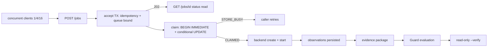

# Operating-envelope architecture

Single SQLite connection, `synchronized` store methods, `busy_timeout = 0`.
Submission (accept) and completion (claim + backend) are separate columns;
status reads share the same monitor, so they degrade with dispatch contention.

## Limitation statement

Single host, single active service, SQLite-backed. Results describe this
machine only and are not enterprise-scale claims. The Docker tier reports
`UNAVAILABLE` when Docker is absent; nothing is substituted.
